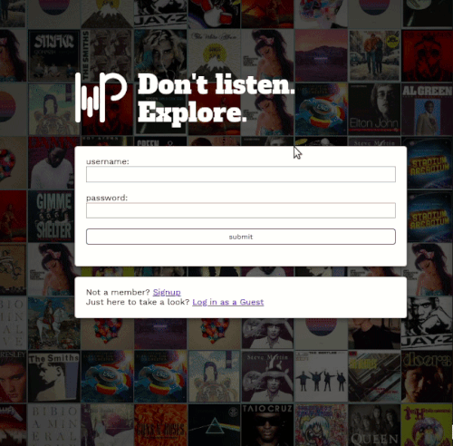
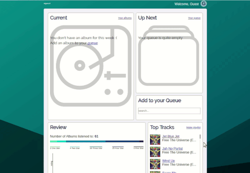
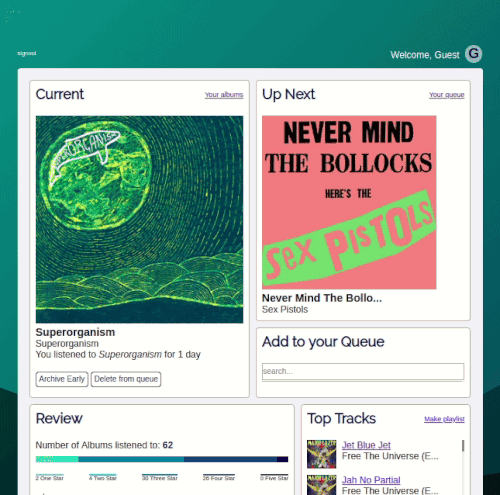
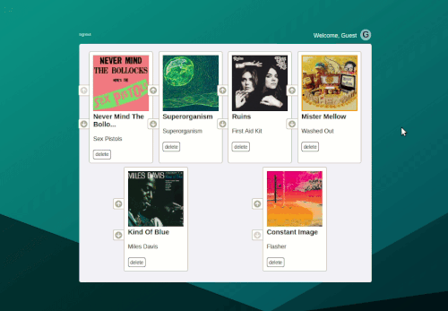
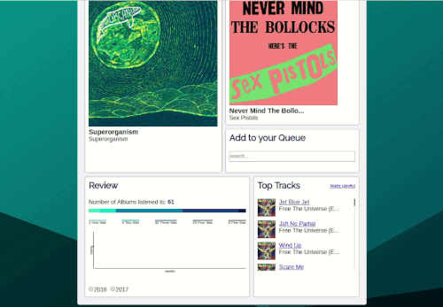

# Music Project

## Getting Started
0. Pre reqs
    * Node 
    * PostgreSQL
1. Fork and clone this repository
2. run `npm i` from the root directory
3. run `createdb music_project_dev`
4. run `npm run knex migrate:latest` from ./backend

## Built With
* [PostgreSQL](https://www.postgresql.org/) - Object-relational database system
* [Knex](https://knexjs.org/) - SQL query builder

## Authors
Dylan Kite - [dylankite.com](http://dylankite.com/)

## License
This project has no official lisence. All code and icons are available for reuse.

## Origin Story
Music Project started humbly in 2016 as a means of expanding musical horizons, tracking new music I listened to using a spreadsheet. In 2018 I built a [static webpage](http://dylankite.com/musicproject) to hold my progress. In a handful of months I took musicproject from a static webpage to a fullstack project making use of authentication and authorization, the Spotify API, a PostgreSQL database and more. Check it out at [http://dmkite-music-project.surge.sh/](http://dmkite-music-project.surge.sh/)

## Screenshots

